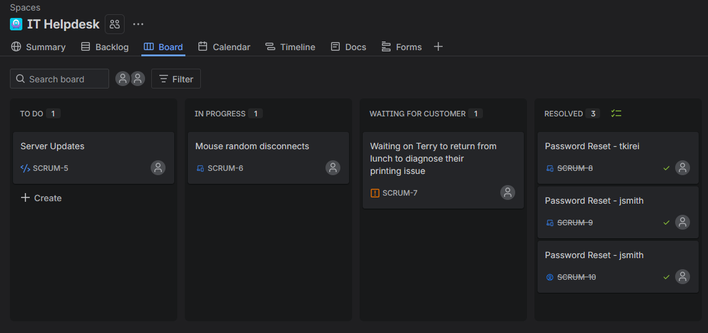
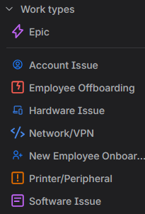
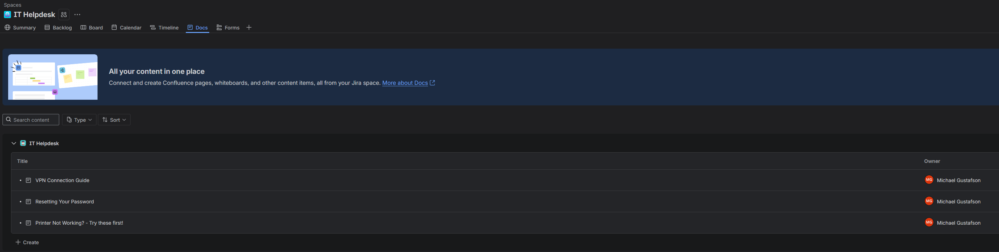
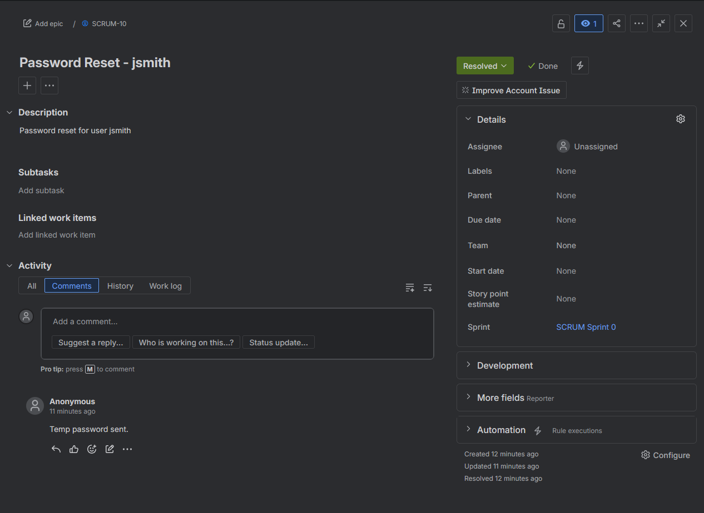

# Jira Service Management Lab

**Implemented and configured Jira Service Management** to demonstrate practical experience with IT support ticketing systems, workflows, and knowledge base management.

## What I Built
- A fully functional Jira Service Management project ("IT Helpdesk")
- Custom Work Types / Request Types:
  - Hardware Issue
  - Software Issue
  - Account Issue
  - Network / VPN
  - Printer / Peripheral
  - New Employee Onboarding
  - Employee Offboarding
- Priority levels and basic workflows
- A Knowledge Base with articles for common issues
- Active ticket board showing real support workflow in action

## Key Skills Demonstrated
- IT service management and ticketing system configuration
- Creating and managing request types and workflows
- Building a knowledge base for end-user self-service
- Priority and SLA management
- Support process documentation

## Screenshots

**Jira Service Management Board Overview**

**Custom Work Types / Request Types**

**Knowledge Base Articles**

**Sample Ticket - Password Reset**

